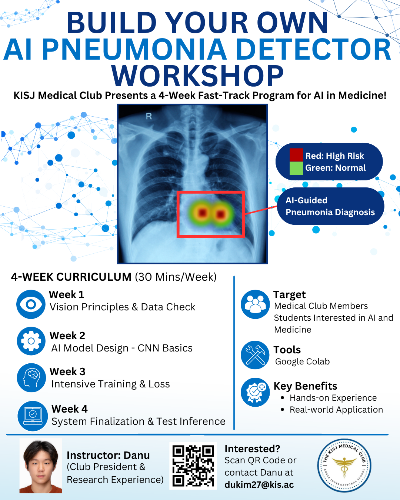

# AI Pneumonia Detector Workshop
### KISJ Medical Club 4-Week Fast-Track Program for AI in Medicine



This repository contains the full lecture notes and Google Colab notebook content for the **AI Pneumonia Detector Workshop**, a 4-week hands-on program hosted by the **Medical Club at Korea International School, Jeju Campus (KISJ)**.

As the **Medical Club President**, I designed and tutored this workshop for students interested in artificial intelligence, computer vision, and medicine. The workshop guided students through a complete beginner-friendly medical AI workflow: loading chest X-ray data, building a CNN model, training it, saving it, and running inference on unseen test images.

> **Important note:** This project is for educational purposes only. It is not intended for clinical diagnosis, medical decision-making, or professional healthcare use.

---

## Program Overview

- **Organizer:** KISJ Medical Club
- **School:** Korea International School, Jeju Campus
- **Instructor:** Danu Kim, Medical Club President
- **Format:** 4-week fast-track workshop
- **Session Length:** 30 minutes per week
- **Target Audience:** Medical Club members and students interested in AI and medicine
- **Main Tool:** Google Colab
- **Main Topic:** Chest X-ray pneumonia classification using a CNN

---

## Curriculum Summary

| Week | Topic | Main Focus |
|---|---|---|
| Week 1 | Vision Principles & Data Check | Google Colab, datasets, PneumoniaMNIST, normal vs. pneumonia X-ray visualization |
| Week 2 | AI Model Design - CNN Basics | Conv2D, MaxPooling, Flatten, Dense, Sequential CNN model construction |
| Week 3 | Intensive Training & Loss | Epoch, loss, accuracy, model training, training graphs, model saving |
| Week 4 | System Finalization & Test Inference | Loading a saved model, test evaluation, prediction confidence, inference on unseen images |

---

## Repository Structure

```
AI-Pneumonia-Detector-Workshop/
|
├── README.md
├── assets/
│   └── workshop-poster.png
|
├── medicalclub-week-1.ipynb
├── medicalclub-week-1.pdf
├── medicalclub-week-2.ipynb
├── medicalclub-week-2.pdf
├── medicalclub-week-3.ipynb
├── medicalclub-week-3.pdf
├── medicalclub-week-4.ipynb
└── medicalclub-week-4.pdf
```

---

## Tools and Technologies

- Python
- Google Colab
- TensorFlow / Keras
- Convolutional Neural Networks (CNNs)
- MedMNIST / PneumoniaMNIST
- NumPy
- Matplotlib

---

## Dataset

This workshop uses **PneumoniaMNIST**, a lightweight chest X-ray image dataset prepared for machine learning practice. Each image is assigned a binary label:

- `0` = Normal
- `1` = Pneumonia

Reference:

> J. Yang, R. Shi, D. Wei, Z. Liu, L. Zhao, B. Ke, H. Pfister, and B. Ni, “MedMNIST v2: A large-scale lightweight benchmark for 2D and 3D biomedical image classification,” *Scientific Data*, vol. 10, no. 1, Art. no. 41, 2023.

---

## Final Workflow Learned by Students

By the end of the workshop, students completed the following AI project workflow:

1. Open and use Google Colab
2. Install and import the MedMNIST package
3. Load the PneumoniaMNIST chest X-ray dataset
4. Inspect the number of images and labels
5. Display normal and pneumonia X-ray examples
6. Build a CNN using TensorFlow/Keras
7. Compile the model with an optimizer, loss function, and accuracy metric
8. Convert image data into NumPy arrays
9. Normalize image pixels to `[0, 1]`
10. Train the CNN model
11. Visualize loss and accuracy
12. Save the trained model
13. Load the saved model
14. Evaluate the model on test data
15. Predict whether unseen X-ray images show normal or pneumonia cases
16. Interpret prediction confidence
17. Discuss the role and limits of AI in medical imaging

---

## Instructor Role

**Danu Kim**  
Medical Club President  
Korea International School, Jeju Campus

Responsibilities:

- Designed the 4-week workshop curriculum
- Prepared weekly lecture notes and Colab notebooks
- Tutored students during Medical Club sessions
- Explained AI concepts in beginner-friendly language
- Guided students through coding, training, and inference
- Connected computer vision concepts to real-world medical applications

---

## Educational Purpose and Disclaimer

This project was created as a student-led educational workshop to introduce AI in medicine. Although it uses chest X-ray data and pneumonia classification as the central example, the workshop model is not a medical device and should not be used for diagnosis or treatment decisions.

AI can support pattern recognition and decision-making, but clinical interpretation must be performed by qualified medical professionals.
